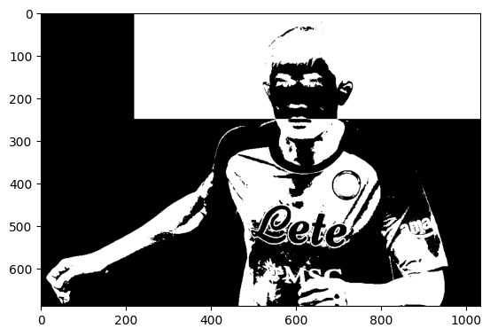
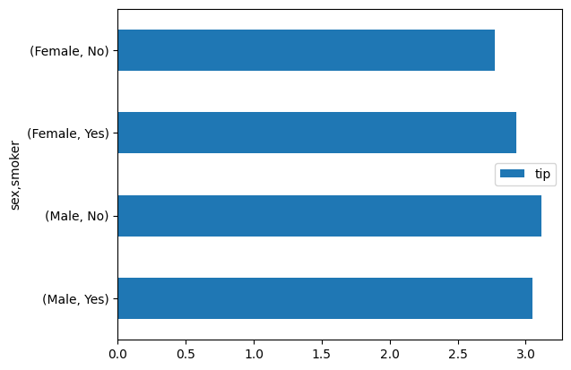

```python
import numpy as np
np.__version__
```


    '1.24.4'


```python
import pandas as pd
pd.__version__
```


    '2.0.3'


```python
import matplotlib
matplotlib.__version__
```


    '3.7.2'


```python
l = [10, 20, 30]
sum_ = 0.0
m = 0.0
for e in l:
    sum_ += e
    m += 1
sum_ / m
```


    20.0


```python
a = np.array([10, 20, 30])
a.mean(), a.sum()
```


    (20.0, 60)


# 넘파이 개념
## ndarray (다차원배열)
* 객체 생성


```python
from numpy import array

a1 = array([10, 20, 30])
a1
```


    array([10, 20, 30])


```python
a2 = array([[10, 20, 30], [40, 50, 60]])
a2
```


    array([[10, 20, 30],
           [40, 50, 60]])


* 속성 조회
    - 모양: shape
    - 차원: ndim
    - 요소의 데이터타입: dtype


```python
a1.shape
```


    (3,)


```python
a2.shape
```


    (2, 3)


```python
a1.ndim
```


    1


```python
a2.ndim
```


    2


```python
a1.dtype
```


    dtype('int32')


```python
a2.dtype
```


    dtype('int32')


```python
type(a1)
```


    numpy.ndarray


```python
# 정수색인: 차원 축소
a1[1]
```


    20


```python
a2[0,1]
```


    20


```python
# 슬라이싱: 차원 유지, 구간색인
a1[1:]
```


    array([20, 30])


```python
a2[:1, 1:]
```


    array([[20, 30]])


```python
# 불리언 색인
a1 < 30
```


    array([ True,  True, False])


```python
a1[[True, True, False]]
```


    array([10, 20])


```python
a1[a1 < 30]
```


    array([10, 20])


```python
# 팬시 색인 : 정렬
a1
```


    array([10, 20, 30])


```python
a1[[2, 0]]
```


    array([30, 10])


# 연산
1. 축
2. 브로드캐스팅


```python
# 축
# a2의 열 별 합계
a2.sum(0)
```


    array([50, 70, 90])


```python
# a2의 행 별 합계
a2.sum(1)
```


    array([ 60, 150])


```python
a2.sum()
```


    210


```python
# 집계함수인 인스턴스 메소드
a2.mean(0)
```


    array([25., 35., 45.])


```python
a2.min()
```


    10


```python
a2.max()
```


    60


```python
s ="“15일 만에 결혼 결심…” 광수♥옥순, 곧 부부된다 ‘대박’ (‘나는솔로’) [어저께TV]"
s.split()
```


    ['“15일',
     '만에',
     '결혼',
     '결심…”',
     '광수♥옥순,',
     '곧',
     '부부된다',
     '‘대박’',
     '(‘나는솔로’)',
     '[어저께TV]']


# 브로드캐스팅


```python
a2
```


    array([[10, 20, 30],
           [40, 50, 60]])


```python
a2 + 3
```


    array([[13, 23, 33],
           [43, 53, 63]])


```python
# a2 + array([3, 3])
```


```python
a2 + array([3, 3]).reshape(2, 1)
```


    array([[13, 23, 33],
           [43, 53, 63]])


# 맷플롯립과 넘파이 활용 이미지 처리


```python
import matplotlib.pyplot as plt
img = plt.imread('../kmg.PNG')                  # jpg를 읽는다면. .copy() 붙여요~
print(img.shape)
```

    (689, 1035, 4)
    


```python
# 좌상단은 빨갛게, 우상단은 반전
img.dtype
```


    dtype('float32')


```python
img[0:250, 0:220, 0] = 1.0 # 좌상단은 빨갛게
img[0:250, 220:] = 1.0 - img[0:250, 220:]
```


```python
plt.imshow(img)
```


    <matplotlib.image.AxesImage at 0x247f00b2520>


    

    


```python
green = img[:, :, 1]
green[green > 0.5] = 1.0
green[green <=0.5] = 0.0
plt.imshow(green, cmap='gray')
```


    <matplotlib.image.AxesImage at 0x247f02ecb80>


    

    


# 로또 번호 추첨기


```python
from numpy.random import permutation
# 로또 추첨기는 1 ~ 45 공을 한 개씩 포함 ( 균등 분포 )
# 중복 안함
# 총 6개 공을 추첨
for _ in range(10):
    lotto = (permutation(45) + 1)[:6]
    print(lotto)
```

    [ 7 26 14  5 36  3]
    [32 21 11 34  4 13]
    [43 15 10 25 20 42]
    [15 14  2 38 20 24]
    [ 6 41 37  9 24 38]
    [31 22 43  1 45 24]
    [23 22 44 25 41  2]
    [34  7 45  5  8 26]
    [43 33 27  4 26  8]
    [10 45 19 28 41  3]
    

# 정규분포에서 값을 뽑아서 히스토그램 시각화


```python
plt.hist?
```


    Signature:
    plt.hist(
        x,
        bins=None,
        range=None,
        density=False,
        weights=None,
        cumulative=False,
        bottom=None,
        histtype='bar',
        align='mid',
        orientation='vertical',
        rwidth=None,
        log=False,
        color=None,
        label=None,
        stacked=False,
        *,
        data=None,
        **kwargs,
    )
    Docstring:
    Compute and plot a histogram.
    
    This method uses `numpy.histogram` to bin the data in *x* and count the
    number of values in each bin, then draws the distribution either as a
    `.BarContainer` or `.Polygon`. The *bins*, *range*, *density*, and
    *weights* parameters are forwarded to `numpy.histogram`.
    
    If the data has already been binned and counted, use `~.bar` or
    `~.stairs` to plot the distribution::
    
        counts, bins = np.histogram(x)
        plt.stairs(counts, bins)
    
    Alternatively, plot pre-computed bins and counts using ``hist()`` by
    treating each bin as a single point with a weight equal to its count::
    
        plt.hist(bins[:-1], bins, weights=counts)
    
    The data input *x* can be a singular array, a list of datasets of
    potentially different lengths ([*x0*, *x1*, ...]), or a 2D ndarray in
    which each column is a dataset. Note that the ndarray form is
    transposed relative to the list form. If the input is an array, then
    the return value is a tuple (*n*, *bins*, *patches*); if the input is a
    sequence of arrays, then the return value is a tuple
    ([*n0*, *n1*, ...], *bins*, [*patches0*, *patches1*, ...]).
    
    Masked arrays are not supported.
    
    Parameters
    ----------
    x : (n,) array or sequence of (n,) arrays
        Input values, this takes either a single array or a sequence of
        arrays which are not required to be of the same length.
    
    bins : int or sequence or str, default: :rc:`hist.bins`
        If *bins* is an integer, it defines the number of equal-width bins
        in the range.
    
        If *bins* is a sequence, it defines the bin edges, including the
        left edge of the first bin and the right edge of the last bin;
        in this case, bins may be unequally spaced.  All but the last
        (righthand-most) bin is half-open.  In other words, if *bins* is::
    
            [1, 2, 3, 4]
    
        then the first bin is ``[1, 2)`` (including 1, but excluding 2) and
        the second ``[2, 3)``.  The last bin, however, is ``[3, 4]``, which
        *includes* 4.
    
        If *bins* is a string, it is one of the binning strategies
        supported by `numpy.histogram_bin_edges`: 'auto', 'fd', 'doane',
        'scott', 'stone', 'rice', 'sturges', or 'sqrt'.
    
    range : tuple or None, default: None
        The lower and upper range of the bins. Lower and upper outliers
        are ignored. If not provided, *range* is ``(x.min(), x.max())``.
        Range has no effect if *bins* is a sequence.
    
        If *bins* is a sequence or *range* is specified, autoscaling
        is based on the specified bin range instead of the
        range of x.
    
    density : bool, default: False
        If ``True``, draw and return a probability density: each bin
        will display the bin's raw count divided by the total number of
        counts *and the bin width*
        (``density = counts / (sum(counts) * np.diff(bins))``),
        so that the area under the histogram integrates to 1
        (``np.sum(density * np.diff(bins)) == 1``).
    
        If *stacked* is also ``True``, the sum of the histograms is
        normalized to 1.
    
    weights : (n,) array-like or None, default: None
        An array of weights, of the same shape as *x*.  Each value in
        *x* only contributes its associated weight towards the bin count
        (instead of 1).  If *density* is ``True``, the weights are
        normalized, so that the integral of the density over the range
        remains 1.
    
    cumulative : bool or -1, default: False
        If ``True``, then a histogram is computed where each bin gives the
        counts in that bin plus all bins for smaller values. The last bin
        gives the total number of datapoints.
    
        If *density* is also ``True`` then the histogram is normalized such
        that the last bin equals 1.
    
        If *cumulative* is a number less than 0 (e.g., -1), the direction
        of accumulation is reversed.  In this case, if *density* is also
        ``True``, then the histogram is normalized such that the first bin
        equals 1.
    
    bottom : array-like, scalar, or None, default: None
        Location of the bottom of each bin, i.e. bins are drawn from
        ``bottom`` to ``bottom + hist(x, bins)`` If a scalar, the bottom
        of each bin is shifted by the same amount. If an array, each bin
        is shifted independently and the length of bottom must match the
        number of bins. If None, defaults to 0.
    
    histtype : {'bar', 'barstacked', 'step', 'stepfilled'}, default: 'bar'
        The type of histogram to draw.
    
        - 'bar' is a traditional bar-type histogram.  If multiple data
          are given the bars are arranged side by side.
        - 'barstacked' is a bar-type histogram where multiple
          data are stacked on top of each other.
        - 'step' generates a lineplot that is by default unfilled.
        - 'stepfilled' generates a lineplot that is by default filled.
    
    align : {'left', 'mid', 'right'}, default: 'mid'
        The horizontal alignment of the histogram bars.
    
        - 'left': bars are centered on the left bin edges.
        - 'mid': bars are centered between the bin edges.
        - 'right': bars are centered on the right bin edges.
    
    orientation : {'vertical', 'horizontal'}, default: 'vertical'
        If 'horizontal', `~.Axes.barh` will be used for bar-type histograms
        and the *bottom* kwarg will be the left edges.
    
    rwidth : float or None, default: None
        The relative width of the bars as a fraction of the bin width.  If
        ``None``, automatically compute the width.
    
        Ignored if *histtype* is 'step' or 'stepfilled'.
    
    log : bool, default: False
        If ``True``, the histogram axis will be set to a log scale.
    
    color : color or array-like of colors or None, default: None
        Color or sequence of colors, one per dataset.  Default (``None``)
        uses the standard line color sequence.
    
    label : str or None, default: None
        String, or sequence of strings to match multiple datasets.  Bar
        charts yield multiple patches per dataset, but only the first gets
        the label, so that `~.Axes.legend` will work as expected.
    
    stacked : bool, default: False
        If ``True``, multiple data are stacked on top of each other If
        ``False`` multiple data are arranged side by side if histtype is
        'bar' or on top of each other if histtype is 'step'
    
    Returns
    -------
    n : array or list of arrays
        The values of the histogram bins. See *density* and *weights* for a
        description of the possible semantics.  If input *x* is an array,
        then this is an array of length *nbins*. If input is a sequence of
        arrays ``[data1, data2, ...]``, then this is a list of arrays with
        the values of the histograms for each of the arrays in the same
        order.  The dtype of the array *n* (or of its element arrays) will
        always be float even if no weighting or normalization is used.
    
    bins : array
        The edges of the bins. Length nbins + 1 (nbins left edges and right
        edge of last bin).  Always a single array even when multiple data
        sets are passed in.
    
    patches : `.BarContainer` or list of a single `.Polygon` or list of such objects
        Container of individual artists used to create the histogram
        or list of such containers if there are multiple input datasets.
    
    Other Parameters
    ----------------
    data : indexable object, optional
        If given, the following parameters also accept a string ``s``, which is
        interpreted as ``data[s]`` (unless this raises an exception):
    
        *x*, *weights*
    
    **kwargs
        `~matplotlib.patches.Patch` properties
    
    See Also
    --------
    hist2d : 2D histogram with rectangular bins
    hexbin : 2D histogram with hexagonal bins
    stairs : Plot a pre-computed histogram
    bar : Plot a pre-computed histogram
    
    Notes
    -----
    For large numbers of bins (>1000), plotting can be significantly
    accelerated by using `~.Axes.stairs` to plot a pre-computed histogram
    (``plt.stairs(*np.histogram(data))``), or by setting *histtype* to
    'step' or 'stepfilled' rather than 'bar' or 'barstacked'.
    File:      c:\anaconda3\envs\chatbot\lib\site-packages\matplotlib\pyplot.py
    Type:      function


```python
from numpy.random import normal, randn
import matplotlib.pyplot as plt

d1 = normal(loc=0.0, scale=1.0, size=10000)
# plt.hist(d1, bins=20)
plt.hist(d1, bins=2000, density=True)
```


    (array([0.02844127, 0.        , 0.        , ..., 0.        , 0.        ,
            0.02844127]),
     array([-3.47835181, -3.4748358 , -3.47131978, ...,  3.54665125,
             3.55016727,  3.55368329]),
     <BarContainer object of 2000 artists>)


    

    


```python
from numpy.random import normal, randn
import matplotlib.pyplot as plt

d1 = normal(loc=0.0, scale=1.0, size=10000)
# plt.hist(d1, bins=20)
plt.hist(d1, bins=2000, density=True)
```


    (array([0.02615325, 0.        , 0.        , ..., 0.        , 0.        ,
            0.02615325]),
     array([-3.87647545, -3.87265184, -3.86882822, ...,  3.76311005,
             3.76693366,  3.77075728]),
     <BarContainer object of 2000 artists>)


    

    


```python
d2 = randn(100, 200)
# plt.imshow(d2, cmap='gray')
plt.hist(d2.flatten(), bins=2000, density=True)
```


    (array([0.01259873, 0.        , 0.        , ..., 0.        , 0.        ,
            0.01259873]),
     array([-4.02817249, -4.02420384, -4.02023519, ...,  3.90119537,
             3.90516402,  3.90913267]),
     <BarContainer object of 2000 artists>)


    

    


# 균등분포: uniform, rand


```python
from numpy.random import uniform, rand

d1 = uniform(low=-1.0, high=1.0, size=10000)
plt.hist(d1, bins=2000, density=True)
```


    (array([0.70031223, 0.30013381, 0.50022302, ..., 0.30013381, 0.50022302,
            0.40017842]),
     array([-0.99982978, -0.99883022, -0.99783067, ...,  0.99727942,
             0.99827897,  0.99927853]),
     <BarContainer object of 2000 artists>)


    

    


```python
# d1 = uniform(low=-1.0, high=1.0, size=10000)
# plt.hist(d1, bins=2000, density=True)
d2 = rand(100, 200)
plt.hist(d2.flatten(), bins=2000, density=True)
```


    (array([0.70001071, 1.0000153 , 1.50002295, ..., 1.0000153 , 1.30001989,
            1.0000153 ]),
     array([1.42324059e-07, 5.00134674e-04, 1.00012702e-03, ...,
            9.98984858e-01, 9.99484851e-01, 9.99984843e-01]),
     <BarContainer object of 2000 artists>)


    

    


```python
from numpy import array, arange
a1 = arange(10, 40, 10)
a2 = arange(10, 70, 10).reshape(2, 3)
a1
```


    array([10, 20, 30])


```python
a2
```


    array([[10, 20, 30],
           [40, 50, 60]])


```python
from pandas import Series, DataFrame
import pandas as pd

s = Series(a1, index=['국어', '수학', '영어'])
s
```


    국어    10
    수학    20
    영어    30
    dtype: int32


```python
df = DataFrame(a2, 
               index=['영희', '철수'], 
               columns=['국어', '수학', '영어'])
df
```


<div>
<style scoped>
    .dataframe tbody tr th:only-of-type {
        vertical-align: middle;
    }

    .dataframe tbody tr th {
        vertical-align: top;
    }

    .dataframe thead th {
        text-align: right;
    }
</style>
<table border="1" class="dataframe">
  <thead>
    <tr style="text-align: right;">
      <th></th>
      <th>국어</th>
      <th>수학</th>
      <th>영어</th>
    </tr>
  </thead>
  <tbody>
    <tr>
      <th>영희</th>
      <td>10</td>
      <td>20</td>
      <td>30</td>
    </tr>
    <tr>
      <th>철수</th>
      <td>40</td>
      <td>50</td>
      <td>60</td>
    </tr>
  </tbody>
</table>
</div>


```python
# 과목 별 평균
df.mean(0)
```


    국어    25.0
    수학    35.0
    영어    45.0
    dtype: float64


```python
# 개인 별 평균
df.mean(1)
```


    영희    20.0
    철수    50.0
    dtype: float64


```python
# 수학 과목에 대한 점수만 선택
df.수학
```


    영희    20
    철수    50
    Name: 수학, dtype: int32


```python
df['수학']
```


    영희    20
    철수    50
    Name: 수학, dtype: int32


```python
df['영희':'영희']
```


<div>
<style scoped>
    .dataframe tbody tr th:only-of-type {
        vertical-align: middle;
    }

    .dataframe tbody tr th {
        vertical-align: top;
    }

    .dataframe thead th {
        text-align: right;
    }
</style>
<table border="1" class="dataframe">
  <thead>
    <tr style="text-align: right;">
      <th></th>
      <th>국어</th>
      <th>수학</th>
      <th>영어</th>
    </tr>
  </thead>
  <tbody>
    <tr>
      <th>영희</th>
      <td>10</td>
      <td>20</td>
      <td>30</td>
    </tr>
  </tbody>
</table>
</div>


```python
df
```


<div>
<style scoped>
    .dataframe tbody tr th:only-of-type {
        vertical-align: middle;
    }

    .dataframe tbody tr th {
        vertical-align: top;
    }

    .dataframe thead th {
        text-align: right;
    }
</style>
<table border="1" class="dataframe">
  <thead>
    <tr style="text-align: right;">
      <th></th>
      <th>국어</th>
      <th>수학</th>
      <th>영어</th>
    </tr>
  </thead>
  <tbody>
    <tr>
      <th>영희</th>
      <td>10</td>
      <td>20</td>
      <td>30</td>
    </tr>
    <tr>
      <th>철수</th>
      <td>40</td>
      <td>50</td>
      <td>60</td>
    </tr>
  </tbody>
</table>
</div>


```python
# [실습 및 휴식] ~ 2:00
```


```python
# 1. 영어, 수학 순서로 색인 (팬시색인)
df.loc[:, ['영어', '수학']]
```


<div>
<style scoped>
    .dataframe tbody tr th:only-of-type {
        vertical-align: middle;
    }

    .dataframe tbody tr th {
        vertical-align: top;
    }

    .dataframe thead th {
        text-align: right;
    }
</style>
<table border="1" class="dataframe">
  <thead>
    <tr style="text-align: right;">
      <th></th>
      <th>영어</th>
      <th>수학</th>
    </tr>
  </thead>
  <tbody>
    <tr>
      <th>영희</th>
      <td>30</td>
      <td>20</td>
    </tr>
    <tr>
      <th>철수</th>
      <td>60</td>
      <td>50</td>
    </tr>
  </tbody>
</table>
</div>


```python
df.iloc[:, [2, 1]]
```


<div>
<style scoped>
    .dataframe tbody tr th:only-of-type {
        vertical-align: middle;
    }

    .dataframe tbody tr th {
        vertical-align: top;
    }

    .dataframe thead th {
        text-align: right;
    }
</style>
<table border="1" class="dataframe">
  <thead>
    <tr style="text-align: right;">
      <th></th>
      <th>영어</th>
      <th>수학</th>
    </tr>
  </thead>
  <tbody>
    <tr>
      <th>영희</th>
      <td>30</td>
      <td>20</td>
    </tr>
    <tr>
      <th>철수</th>
      <td>60</td>
      <td>50</td>
    </tr>
  </tbody>
</table>
</div>


```python
df[['영어', '수학']]
```


<div>
<style scoped>
    .dataframe tbody tr th:only-of-type {
        vertical-align: middle;
    }

    .dataframe tbody tr th {
        vertical-align: top;
    }

    .dataframe thead th {
        text-align: right;
    }
</style>
<table border="1" class="dataframe">
  <thead>
    <tr style="text-align: right;">
      <th></th>
      <th>영어</th>
      <th>수학</th>
    </tr>
  </thead>
  <tbody>
    <tr>
      <th>영희</th>
      <td>30</td>
      <td>20</td>
    </tr>
    <tr>
      <th>철수</th>
      <td>60</td>
      <td>50</td>
    </tr>
  </tbody>
</table>
</div>


```python
# 2. 국어부터 수학까지 색인 (슬라이싱)
df.loc[:, '국어':'수학']
```


<div>
<style scoped>
    .dataframe tbody tr th:only-of-type {
        vertical-align: middle;
    }

    .dataframe tbody tr th {
        vertical-align: top;
    }

    .dataframe thead th {
        text-align: right;
    }
</style>
<table border="1" class="dataframe">
  <thead>
    <tr style="text-align: right;">
      <th></th>
      <th>국어</th>
      <th>수학</th>
    </tr>
  </thead>
  <tbody>
    <tr>
      <th>영희</th>
      <td>10</td>
      <td>20</td>
    </tr>
    <tr>
      <th>철수</th>
      <td>40</td>
      <td>50</td>
    </tr>
  </tbody>
</table>
</div>


```python
df.iloc[:, 0:2]
```


<div>
<style scoped>
    .dataframe tbody tr th:only-of-type {
        vertical-align: middle;
    }

    .dataframe tbody tr th {
        vertical-align: top;
    }

    .dataframe thead th {
        text-align: right;
    }
</style>
<table border="1" class="dataframe">
  <thead>
    <tr style="text-align: right;">
      <th></th>
      <th>국어</th>
      <th>수학</th>
    </tr>
  </thead>
  <tbody>
    <tr>
      <th>영희</th>
      <td>10</td>
      <td>20</td>
    </tr>
    <tr>
      <th>철수</th>
      <td>40</td>
      <td>50</td>
    </tr>
  </tbody>
</table>
</div>


```python
# 3. 철수, 영희의 순서로 색인 (팬시색인)
df.loc[['철수', '영희']]
```


<div>
<style scoped>
    .dataframe tbody tr th:only-of-type {
        vertical-align: middle;
    }

    .dataframe tbody tr th {
        vertical-align: top;
    }

    .dataframe thead th {
        text-align: right;
    }
</style>
<table border="1" class="dataframe">
  <thead>
    <tr style="text-align: right;">
      <th></th>
      <th>국어</th>
      <th>수학</th>
      <th>영어</th>
    </tr>
  </thead>
  <tbody>
    <tr>
      <th>철수</th>
      <td>40</td>
      <td>50</td>
      <td>60</td>
    </tr>
    <tr>
      <th>영희</th>
      <td>10</td>
      <td>20</td>
      <td>30</td>
    </tr>
  </tbody>
</table>
</div>


```python
df.iloc[[1, 0]]
```


<div>
<style scoped>
    .dataframe tbody tr th:only-of-type {
        vertical-align: middle;
    }

    .dataframe tbody tr th {
        vertical-align: top;
    }

    .dataframe thead th {
        text-align: right;
    }
</style>
<table border="1" class="dataframe">
  <thead>
    <tr style="text-align: right;">
      <th></th>
      <th>국어</th>
      <th>수학</th>
      <th>영어</th>
    </tr>
  </thead>
  <tbody>
    <tr>
      <th>철수</th>
      <td>40</td>
      <td>50</td>
      <td>60</td>
    </tr>
    <tr>
      <th>영희</th>
      <td>10</td>
      <td>20</td>
      <td>30</td>
    </tr>
  </tbody>
</table>
</div>


```python
# 4. 철수 행만 선택 (2차원이 되도록 )
df['철수':'철수']
```


<div>
<style scoped>
    .dataframe tbody tr th:only-of-type {
        vertical-align: middle;
    }

    .dataframe tbody tr th {
        vertical-align: top;
    }

    .dataframe thead th {
        text-align: right;
    }
</style>
<table border="1" class="dataframe">
  <thead>
    <tr style="text-align: right;">
      <th></th>
      <th>국어</th>
      <th>수학</th>
      <th>영어</th>
    </tr>
  </thead>
  <tbody>
    <tr>
      <th>철수</th>
      <td>40</td>
      <td>50</td>
      <td>60</td>
    </tr>
  </tbody>
</table>
</div>


```python
df.loc[['철수']]
```


<div>
<style scoped>
    .dataframe tbody tr th:only-of-type {
        vertical-align: middle;
    }

    .dataframe tbody tr th {
        vertical-align: top;
    }

    .dataframe thead th {
        text-align: right;
    }
</style>
<table border="1" class="dataframe">
  <thead>
    <tr style="text-align: right;">
      <th></th>
      <th>국어</th>
      <th>수학</th>
      <th>영어</th>
    </tr>
  </thead>
  <tbody>
    <tr>
      <th>철수</th>
      <td>40</td>
      <td>50</td>
      <td>60</td>
    </tr>
  </tbody>
</table>
</div>


```python
df.iloc[[1]]
```


<div>
<style scoped>
    .dataframe tbody tr th:only-of-type {
        vertical-align: middle;
    }

    .dataframe tbody tr th {
        vertical-align: top;
    }

    .dataframe thead th {
        text-align: right;
    }
</style>
<table border="1" class="dataframe">
  <thead>
    <tr style="text-align: right;">
      <th></th>
      <th>국어</th>
      <th>수학</th>
      <th>영어</th>
    </tr>
  </thead>
  <tbody>
    <tr>
      <th>철수</th>
      <td>40</td>
      <td>50</td>
      <td>60</td>
    </tr>
  </tbody>
</table>
</div>


```python
import matplotlib.pyplot as plt
# plt.plot(a1)
# plt.plot(a2[0], a2[1])
plt.scatter(a2[0], a2[1])
```


    <matplotlib.collections.PathCollection at 0x247fbeef5e0>


    

    


```python
df.T
```


<div>
<style scoped>
    .dataframe tbody tr th:only-of-type {
        vertical-align: middle;
    }

    .dataframe tbody tr th {
        vertical-align: top;
    }

    .dataframe thead th {
        text-align: right;
    }
</style>
<table border="1" class="dataframe">
  <thead>
    <tr style="text-align: right;">
      <th></th>
      <th>영희</th>
      <th>철수</th>
    </tr>
  </thead>
  <tbody>
    <tr>
      <th>국어</th>
      <td>10</td>
      <td>40</td>
    </tr>
    <tr>
      <th>수학</th>
      <td>20</td>
      <td>50</td>
    </tr>
    <tr>
      <th>영어</th>
      <td>30</td>
      <td>60</td>
    </tr>
  </tbody>
</table>
</div>


```python
df.T.plot(kind='scatter', x='영희', y='철수')
```


    <Axes: xlabel='영희', ylabel='철수'>


    C:\anaconda3\envs\chatbot\lib\site-packages\IPython\core\events.py:89: UserWarning: Glyph 50689 (\N{HANGUL SYLLABLE YEONG}) missing from current font.
      func(*args, **kwargs)
    C:\anaconda3\envs\chatbot\lib\site-packages\IPython\core\events.py:89: UserWarning: Glyph 55148 (\N{HANGUL SYLLABLE HYI}) missing from current font.
      func(*args, **kwargs)
    C:\anaconda3\envs\chatbot\lib\site-packages\IPython\core\events.py:89: UserWarning: Glyph 52384 (\N{HANGUL SYLLABLE CEOL}) missing from current font.
      func(*args, **kwargs)
    C:\anaconda3\envs\chatbot\lib\site-packages\IPython\core\events.py:89: UserWarning: Glyph 49688 (\N{HANGUL SYLLABLE SU}) missing from current font.
      func(*args, **kwargs)
    C:\anaconda3\envs\chatbot\lib\site-packages\IPython\core\pylabtools.py:152: UserWarning: Glyph 50689 (\N{HANGUL SYLLABLE YEONG}) missing from current font.
      fig.canvas.print_figure(bytes_io, **kw)
    C:\anaconda3\envs\chatbot\lib\site-packages\IPython\core\pylabtools.py:152: UserWarning: Glyph 55148 (\N{HANGUL SYLLABLE HYI}) missing from current font.
      fig.canvas.print_figure(bytes_io, **kw)
    C:\anaconda3\envs\chatbot\lib\site-packages\IPython\core\pylabtools.py:152: UserWarning: Glyph 52384 (\N{HANGUL SYLLABLE CEOL}) missing from current font.
      fig.canvas.print_figure(bytes_io, **kw)
    C:\anaconda3\envs\chatbot\lib\site-packages\IPython\core\pylabtools.py:152: UserWarning: Glyph 49688 (\N{HANGUL SYLLABLE SU}) missing from current font.
      fig.canvas.print_figure(bytes_io, **kw)
    


    

    


```python
from pandas.plotting import scatter_matrix
scatter_matrix(df); plt.show()
```

    C:\anaconda3\envs\chatbot\lib\site-packages\IPython\core\pylabtools.py:152: UserWarning: Glyph 44397 (\N{HANGUL SYLLABLE GUG}) missing from current font.
      fig.canvas.print_figure(bytes_io, **kw)
    C:\anaconda3\envs\chatbot\lib\site-packages\IPython\core\pylabtools.py:152: UserWarning: Glyph 50612 (\N{HANGUL SYLLABLE EO}) missing from current font.
      fig.canvas.print_figure(bytes_io, **kw)
    C:\anaconda3\envs\chatbot\lib\site-packages\IPython\core\pylabtools.py:152: UserWarning: Glyph 54617 (\N{HANGUL SYLLABLE HAG}) missing from current font.
      fig.canvas.print_figure(bytes_io, **kw)
    


    

    


```python
!pip install seaborn
```

    Requirement already satisfied: seaborn in c:\anaconda3\envs\chatbot\lib\site-packages (0.12.2)
    Requirement already satisfied: numpy!=1.24.0,>=1.17 in c:\anaconda3\envs\chatbot\lib\site-packages (from seaborn) (1.24.4)
    Requirement already satisfied: pandas>=0.25 in c:\anaconda3\envs\chatbot\lib\site-packages (from seaborn) (2.0.3)
    Requirement already satisfied: matplotlib!=3.6.1,>=3.1 in c:\anaconda3\envs\chatbot\lib\site-packages (from seaborn) (3.7.2)
    Requirement already satisfied: contourpy>=1.0.1 in c:\anaconda3\envs\chatbot\lib\site-packages (from matplotlib!=3.6.1,>=3.1->seaborn) (1.1.0)
    Requirement already satisfied: cycler>=0.10 in c:\anaconda3\envs\chatbot\lib\site-packages (from matplotlib!=3.6.1,>=3.1->seaborn) (0.11.0)
    Requirement already satisfied: fonttools>=4.22.0 in c:\anaconda3\envs\chatbot\lib\site-packages (from matplotlib!=3.6.1,>=3.1->seaborn) (4.41.0)
    Requirement already satisfied: kiwisolver>=1.0.1 in c:\anaconda3\envs\chatbot\lib\site-packages (from matplotlib!=3.6.1,>=3.1->seaborn) (1.4.4)
    Requirement already satisfied: packaging>=20.0 in c:\anaconda3\envs\chatbot\lib\site-packages (from matplotlib!=3.6.1,>=3.1->seaborn) (23.1)
    Requirement already satisfied: pillow>=6.2.0 in c:\anaconda3\envs\chatbot\lib\site-packages (from matplotlib!=3.6.1,>=3.1->seaborn) (10.0.0)
    Requirement already satisfied: pyparsing<3.1,>=2.3.1 in c:\anaconda3\envs\chatbot\lib\site-packages (from matplotlib!=3.6.1,>=3.1->seaborn) (3.0.9)
    Requirement already satisfied: python-dateutil>=2.7 in c:\anaconda3\envs\chatbot\lib\site-packages (from matplotlib!=3.6.1,>=3.1->seaborn) (2.8.2)
    Requirement already satisfied: importlib-resources>=3.2.0 in c:\anaconda3\envs\chatbot\lib\site-packages (from matplotlib!=3.6.1,>=3.1->seaborn) (6.0.0)
    Requirement already satisfied: pytz>=2020.1 in c:\anaconda3\envs\chatbot\lib\site-packages (from pandas>=0.25->seaborn) (2023.3)
    Requirement already satisfied: tzdata>=2022.1 in c:\anaconda3\envs\chatbot\lib\site-packages (from pandas>=0.25->seaborn) (2023.3)
    Requirement already satisfied: zipp>=3.1.0 in c:\anaconda3\envs\chatbot\lib\site-packages (from importlib-resources>=3.2.0->matplotlib!=3.6.1,>=3.1->seaborn) (3.16.2)
    Requirement already satisfied: six>=1.5 in c:\anaconda3\envs\chatbot\lib\site-packages (from python-dateutil>=2.7->matplotlib!=3.6.1,>=3.1->seaborn) (1.16.0)
    


```python
import seaborn as sns
tips = sns.load_dataset('tips')
tips.pivot_table('tip', index=['sex', 'smoker'], aggfunc='mean')
```


<div>
<style scoped>
    .dataframe tbody tr th:only-of-type {
        vertical-align: middle;
    }

    .dataframe tbody tr th {
        vertical-align: top;
    }

    .dataframe thead th {
        text-align: right;
    }
</style>
<table border="1" class="dataframe">
  <thead>
    <tr style="text-align: right;">
      <th></th>
      <th></th>
      <th>tip</th>
    </tr>
    <tr>
      <th>sex</th>
      <th>smoker</th>
      <th></th>
    </tr>
  </thead>
  <tbody>
    <tr>
      <th rowspan="2" valign="top">Male</th>
      <th>Yes</th>
      <td>3.051167</td>
    </tr>
    <tr>
      <th>No</th>
      <td>3.113402</td>
    </tr>
    <tr>
      <th rowspan="2" valign="top">Female</th>
      <th>Yes</th>
      <td>2.931515</td>
    </tr>
    <tr>
      <th>No</th>
      <td>2.773519</td>
    </tr>
  </tbody>
</table>
</div>


```python
tips.pivot_table('tip', index=['sex', 'smoker'], aggfunc='mean').plot(kind='barh')
```


    <Axes: ylabel='sex,smoker'>


    

    


# 자연어처리를 위한 파이썬 패키지의 설치방법
* nltk
    * pip install nltk
* konlpy
    * jdk 설치
    * JAVA_HOME 환경변수에 설치된 jdk 경로 등록
    * JPype 패키지 설치 (수동 다운로드)
        * pip install JPype~.whl
    * pip install konlpy


```python
!python -V
```

    Python 3.8.17
    


```python
import nltk
nltk.__version__
```


    '3.8.1'


```python
import konlpy
konlpy.__version__
```


    '0.6.0'


```python
import os
os.environ['JAVA_HOME']='C:\\Program Files\\Java\\jdk-11'
```


```python
import konlpy
from konlpy.tag import Okt
okt = Okt()

print(okt.morphs("오늘 밤 주인공은 나야 나 나야 나"))
```

    ['오늘', '밤', '주인공', '은', '나야', '나', '나야', '나']
    


```python
import nltk
from nltk.corpus import brown as cb
from nltk.corpus import gutenberg as cg
nltk.download('brown')
nltk.download('gutenberg')
print(cb.categories())
```

    ['adventure', 'belles_lettres', 'editorial', 'fiction', 'government', 'hobbies', 'humor', 'learned', 'lore', 'mystery', 'news', 'religion', 'reviews', 'romance', 'science_fiction']
    

    [nltk_data] Downloading package brown to C:\Users\ILIFO
    [nltk_data]     001\AppData\Roaming\nltk_data...
    [nltk_data]   Package brown is already up-to-date!
    [nltk_data] Downloading package gutenberg to C:\Users\ILIFO
    [nltk_data]     001\AppData\Roaming\nltk_data...
    [nltk_data]   Package gutenberg is already up-to-date!
    

# 데이터 준비
* 크롬 버전 확인 후 크롬 웹드라이버 다운로드하여 작업경로에 준비
* pip install selenium
* daum_crawling.py 실행


```python
!pip install selenium
```

    Requirement already satisfied: selenium in c:\anaconda3\envs\chatbot\lib\site-packages (4.10.0)
    Requirement already satisfied: urllib3[socks]<3,>=1.26 in c:\anaconda3\envs\chatbot\lib\site-packages (from selenium) (2.0.4)
    Requirement already satisfied: trio~=0.17 in c:\anaconda3\envs\chatbot\lib\site-packages (from selenium) (0.22.2)
    Requirement already satisfied: trio-websocket~=0.9 in c:\anaconda3\envs\chatbot\lib\site-packages (from selenium) (0.10.3)
    Requirement already satisfied: certifi>=2021.10.8 in c:\anaconda3\envs\chatbot\lib\site-packages (from selenium) (2023.5.7)
    Requirement already satisfied: attrs>=20.1.0 in c:\anaconda3\envs\chatbot\lib\site-packages (from trio~=0.17->selenium) (23.1.0)
    Requirement already satisfied: sortedcontainers in c:\anaconda3\envs\chatbot\lib\site-packages (from trio~=0.17->selenium) (2.4.0)
    Requirement already satisfied: idna in c:\anaconda3\envs\chatbot\lib\site-packages (from trio~=0.17->selenium) (3.4)
    Requirement already satisfied: outcome in c:\anaconda3\envs\chatbot\lib\site-packages (from trio~=0.17->selenium) (1.2.0)
    Requirement already satisfied: sniffio in c:\anaconda3\envs\chatbot\lib\site-packages (from trio~=0.17->selenium) (1.3.0)
    Requirement already satisfied: cffi>=1.14 in c:\anaconda3\envs\chatbot\lib\site-packages (from trio~=0.17->selenium) (1.15.1)
    Requirement already satisfied: exceptiongroup>=1.0.0rc9 in c:\anaconda3\envs\chatbot\lib\site-packages (from trio~=0.17->selenium) (1.1.2)
    Requirement already satisfied: wsproto>=0.14 in c:\anaconda3\envs\chatbot\lib\site-packages (from trio-websocket~=0.9->selenium) (1.2.0)
    Requirement already satisfied: pysocks!=1.5.7,<2.0,>=1.5.6 in c:\anaconda3\envs\chatbot\lib\site-packages (from urllib3[socks]<3,>=1.26->selenium) (1.7.1)
    Requirement already satisfied: pycparser in c:\anaconda3\envs\chatbot\lib\site-packages (from cffi>=1.14->trio~=0.17->selenium) (2.21)
    Requirement already satisfied: h11<1,>=0.9.0 in c:\anaconda3\envs\chatbot\lib\site-packages (from wsproto>=0.14->trio-websocket~=0.9->selenium) (0.14.0)
    


```python
# %load daum_crawling.py
# !pip install selenium
# !pip install pandas
#
# install chrome-webdriver which is compatible with your chrome browser, 
# and locate it in your working directory

import time
import pandas as pd

from selenium import webdriver
from selenium.webdriver.common.by import By

tabs = ['entertainTab', 'sportsTab', 'movieTab', 'autoTab', 'realestateTab']
data = []

with webdriver.Chrome() as driver:
    driver.get('http://www.daum.net')
    time.sleep(1) # Let the user actually see something!
    for i, tab in enumerate(tabs):
        
        elems = driver.find_elements(By.CSS_SELECTOR, f'#{tab}>a')
        elems[0].click()
        time.sleep(1)
        lis = driver.find_elements(By.CSS_SELECTOR, ".list_txt > li>a.link_txt")
        for j, li in enumerate(lis):
            if len(li.text) > 0:
                # print(f'{li.text}, {i}')
                row = [li.text, i]
                data.append(row)
        time.sleep(1) # Let the user actually see something!
df = pd.DataFrame(data, columns=['text', 'label'])
df.to_pickle('daum_title_0720.pickle')
```

    Error getting version of chromedriver 115. Retrying with chromedriver 114 (attempt 1/5)
    


```python
import pandas as pd
daum_title = pd.read_pickle('daum_title.pickle')
daum_title
```


    ---------------------------------------------------------------------------

    FileNotFoundError                         Traceback (most recent call last)

    Cell In[83], line 2
          1 import pandas as pd
    ----> 2 daum_title = pd.read_pickle('daum_title.pickle')
          3 daum_title
    

    File C:\anaconda3\envs\chatbot\lib\site-packages\pandas\io\pickle.py:179, in read_pickle(filepath_or_buffer, compression, storage_options)
        115 """
        116 Load pickled pandas object (or any object) from file.
        117 
       (...)
        176 4    4    9
        177 """
        178 excs_to_catch = (AttributeError, ImportError, ModuleNotFoundError, TypeError)
    --> 179 with get_handle(
        180     filepath_or_buffer,
        181     "rb",
        182     compression=compression,
        183     is_text=False,
        184     storage_options=storage_options,
        185 ) as handles:
        186     # 1) try standard library Pickle
        187     # 2) try pickle_compat (older pandas version) to handle subclass changes
        188     # 3) try pickle_compat with latin-1 encoding upon a UnicodeDecodeError
        190     try:
        191         # TypeError for Cython complaints about object.__new__ vs Tick.__new__
        192         try:
    

    File C:\anaconda3\envs\chatbot\lib\site-packages\pandas\io\common.py:868, in get_handle(path_or_buf, mode, encoding, compression, memory_map, is_text, errors, storage_options)
        859         handle = open(
        860             handle,
        861             ioargs.mode,
       (...)
        864             newline="",
        865         )
        866     else:
        867         # Binary mode
    --> 868         handle = open(handle, ioargs.mode)
        869     handles.append(handle)
        871 # Convert BytesIO or file objects passed with an encoding
    

    FileNotFoundError: [Errno 2] No such file or directory: 'daum_title.pickle'


```python
import pandas as pd
daum_today = pd.read_pickle('daum_title_0720.pickle')
daum_today['text'][0]
```


```python
re.compile?
```


```python
text = """
크로아티아 국가대표 센터백 요슈코 그바르디올(21, 라이프치히)의 잉글랜드행이 7부 능선을 넘었다. 맨체스터 시티 이적이 임박했다.

영국 정론지 가디언은 20일(한국 시간) "맨시티가 그바르디올 영입을 놓고 라이프치히와 합의했다"면서 "현재 1차 메디컬 테스트를 완료한 것으로 알려졌다. 그간 라이프치히가 요구한 최소 이적료는 1억 유로(약 1417억 원)"라고 보도했다.

공식 발표가 나와봐야 알겠지만 현지 언론에 보도되는 이적료 추정치가 놀랍다. 지난 18일 바이에른 뮌헨 이적을 확정한 김민재(27) 이적료 5000만 유로(약 715억 원)보다 두 배가량 높다.

3년 전 해리 매과이어(30, 맨체스터 유나이티드)가 세운 역대 수비수 최고 이적료(8000만 파운드) 기록이 깨질지 관심이 집중된다.
"""
print(text)

from konlpy.tag import Okt
import re
from collections import Counter

sentences = re.split(r'[\.\?\!]+', text)
sentences
# 한글만 추출
filter_ = re.compile('[^ㄱ-ㅎ|ㅏ-ㅣ|가-힣]+')
```


```python
filter_.sub(' ', text)
```


```python
# 문장 단위로 추출
filtered_sentences = []
for sentence in sentences:
    filtered_sentences.append(filter_.sub(' ', sentence))
print(filtered_sentences)
    
# # 불용어 리스트
stopwords = ['면서', '차', '그간']

# # okt를 활용하여 명사만 추출하고, 불용어는 제거하여 리스트 생성
okt = Okt()

# # 불용어는 제외한 명사 리스트
cleaned_noun_list = []

# # 불용어 제거한 명사로 이루어진 문장 리스트
cleaned_sentence_list = []
for sentence in filtered_sentences:
    nouns = okt.nouns(sentence)
    print(nouns)
    clean_contents = [noun for noun in nouns if not noun in stopwords]
    print(clean_contents)
    cleaned_noun_list.extend(clean_contents)
    cleaned_sentence_list.append(clean_contents)
```


```python
cleaned_noun_list
```


```python
cleaned_sentence_list
```
